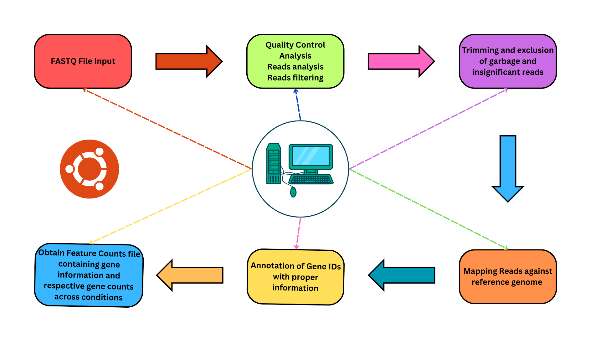
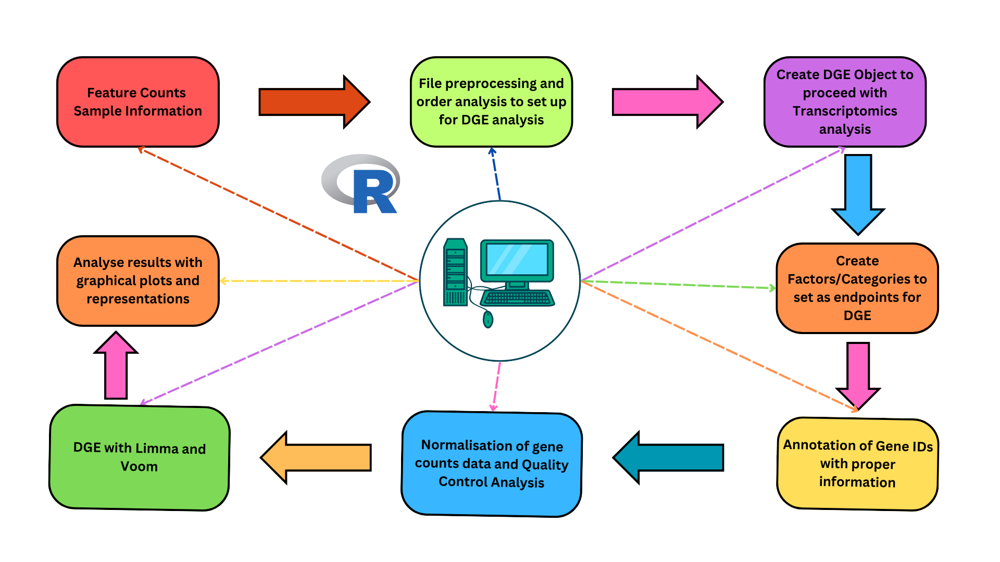

# Research-Transcriptomics-Analysis-Workflows

# RNA-seq Workflow Setup.
## Overall Workflow Setup for Transcriptomic analysis




## Perform installations for all the provided packages in your WSL or Ubuntu Linux Local system to ensure smooth running.
#### Download the sample dataset from here [Download Data File](https://drive.google.com/file/d/1DGHjbhcRy_zTm6H9C_AUpkzBML-JhtA3/view)

```bash
# Update system and packages
sudo apt update

# Install FASTQC for quality analysis of FASTQ File
sudo apt install fastqc  

# Install Trimmomatic for trimming low-quality reads from FASTQ files, which result from poor sequencing signal
sudo apt-get install -y trimmomatic  

# Install HISAT2 for aligning reads to the reference genome
sudo apt-get -y install hisat2  

# Install FeatureCounts (subread package) to compute gene counts based on ENSEMBL IDs
sudo apt install subread  

# Install unzip utility for extracting compressed files
sudo apt install unzip  

# Create a directory for storing files during this workflow
mkdir Reads\ to\ Counts 

# Note: Store your FASTQ file in this folder

```
#### This repository provides a core focus on the end to end analysis workflows concerning Transcriptomics data obtained from NGS sequencing, Microarray experiments etc. Utilising various commericially available software packages and open source programming libraries, we divided the methodology into 2 steps - 

* Transcriptomics Step 1 Reads to Counts.sh - This bash script file is responsible for taking input the FASTQ file or reads obtained from sequencing experiments and performing quality control (QC) checks along with alignment against a reference genome to map these reads ultimately creating a feature counts data with gene annotation to obtain gene counts for each genes under specific biological states.

* Transcriptomics Step 2 Counts to DGE.R - This R script utilises various data analysis and bionformatics libraries to compute Differential Gene Expression Analysis levels across various biological conditions against the list of genes obtained from the featurecounts. Using graphical representations , DEG results are plotted using statistical processes to represent the results in simplified manner.

---
